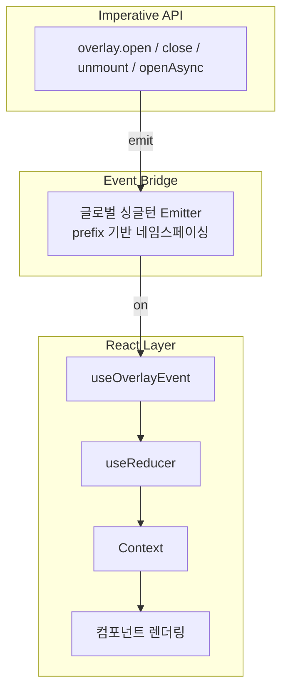
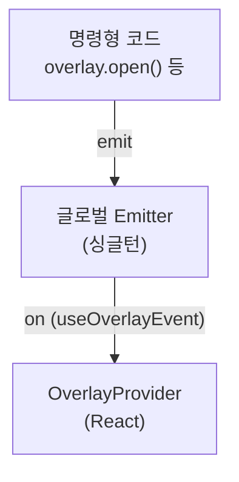

# 레이어 아키텍처

## 3-레이어 구조

overlay-kit은 3개의 레이어로 구성됩니다:



| 레이어 | 파일 | 역할 |
|--------|------|------|
| Imperative API | `event.ts` | 사용자가 호출하는 명령형 함수 (`overlay.open()` 등) |
| Event Bridge | `create-use-external-events.ts` + `emitter.ts` | React 바깥 호출을 React 안으로 전달 + React 바깥에서의 이벤트 구독 (`subscribeEvent`) |
| React Layer | `provider/`, `reducer.ts`, `context.ts` | 상태 관리 + 렌더링 |

## 왜 이 구조인가?

### 문제

`overlay.open()`은 React 컴포넌트 바깥 어디에서든 호출할 수 있어야 합니다.
하지만 React의 상태 관리(`useReducer`)는 컴포넌트 안에서만 작동합니다.

### 해결

글로벌 Event Emitter가 브릿지 역할을 합니다:



`overlay` 객체는 Provider의 존재를 모르고, Provider도 `overlay` 객체를 직접 참조하지 않습니다.
둘은 오직 이벤트를 통해서만 소통합니다.

### 이 구조의 장점

**Decoupling**: `overlay`와 `OverlayProvider`가 서로를 직접 참조하지 않음

```
# Event Emitter 없이 (직접 참조)
overlay.open() ──직접참조──> OverlayProvider.addOverlay()

문제:
- overlay가 Provider를 직접 알아야 함
- 순환 참조 발생 가능
- 테스트 어려움
```

```
# Event Emitter 사용 (현재 구조)
overlay.open() ──emit──> [Emitter] ──on──> Provider

장점:
- overlay는 Provider를 몰라도 됨
- 단방향 의존성
- 테스트 시 이벤트만 mock 가능
```

**다중 구독**: 하나의 이벤트를 여러 구독자가 수신 가능 (Provider, DevTools 등)

**다중 인스턴스**: prefix 기반 네임스페이싱으로 하나의 앱에서 여러 독립적인 overlay 인스턴스 운용 가능

## 이벤트 구독 방식

Event Bridge는 두 가지 구독 방식을 제공합니다:

| 방식 | 함수 | 호출 위치 | 용도 |
|------|------|----------|------|
| React Hook | `useExternalEvents(events)` | `OverlayProvider` 내부 | 이벤트 → dispatch로 변환 (상태 관리) |
| 명령형 구독 | `subscribeEvent(event, handler)` | `openAsync` 내부 등 | React 라이프사이클 바깥에서 이벤트 감지 |

`subscribeEvent`는 `openAsync`에서 외부 close/unmount 이벤트를 감지하여 Promise를 resolve하는 데 사용됩니다. unsubscribe 함수를 반환하여 메모리 누수를 방지합니다.

## 이벤트 타입

| Event | 설명 |
|-------|------|
| `open` | 오버레이 열기 |
| `close` | 특정 오버레이 닫기 |
| `unmount` | 특정 오버레이 메모리 해제 |
| `closeAll` | 모든 오버레이 닫기 |
| `unmountAll` | 모든 오버레이 메모리 해제 |
