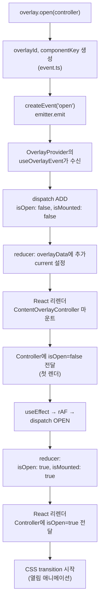
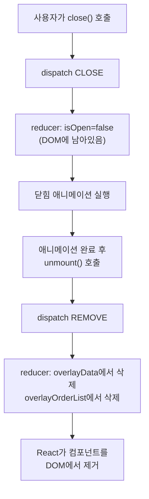
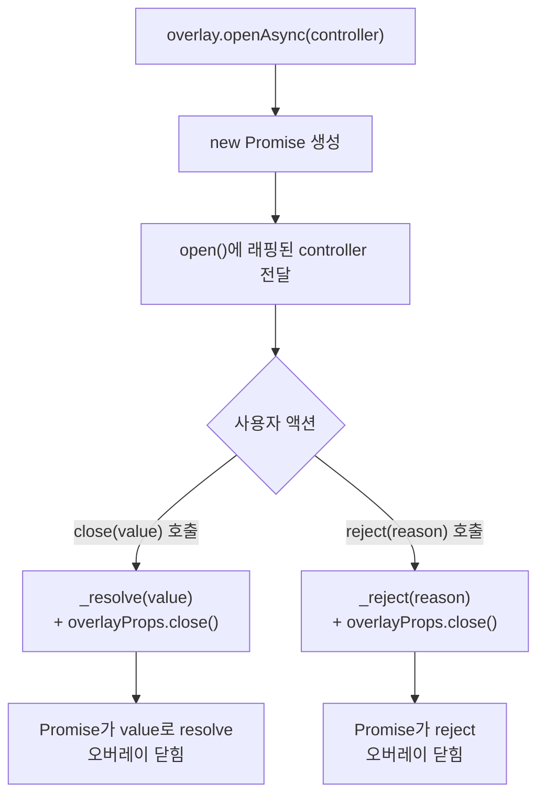
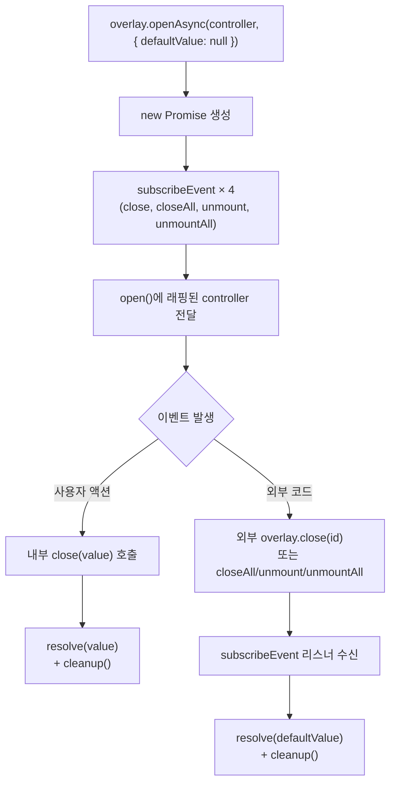
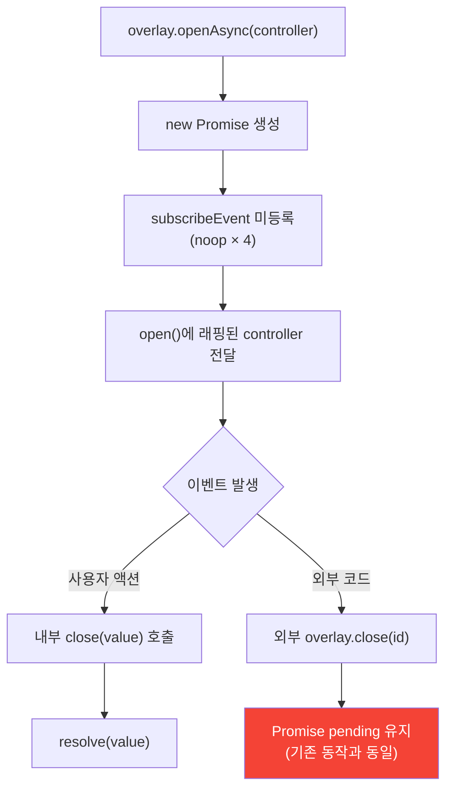

# 오버레이 라이프사이클

## overlay.open() 전체 흐름



### 2-phase open이 필요한 이유

CSS transition은 **속성이 변경될 때** 트리거됩니다. 처음부터 `isOpen: true`로 마운트하면 "변경"이 아니라 "초기값"이므로 transition이 실행되지 않습니다.

해결:
1. `isOpen: false`로 마운트 (초기 상태)
2. 브라우저가 paint 완료 (rAF 대기)
3. `isOpen: true`로 변경 → transition 트리거

이 패턴이 `ContentOverlayController`의 `useEffect + rAF`와 Provider의 `prevOverlayState` 비교 로직 두 곳에서 구현되어 있습니다.

---

## close → unmount 흐름



### close와 unmount가 분리된 이유

- **close** (`CLOSE`): `isOpen: false`로 변경. 컴포넌트가 DOM에 남아있어 닫힘 애니메이션이 가능합니다.
- **unmount** (`REMOVE`): 컴포넌트를 DOM에서 완전히 제거합니다. 메모리를 해제합니다.

일반적인 사용 패턴:

```typescript
overlay.open(({ isOpen, close, unmount }) => (
  <Dialog
    open={isOpen}           // transition 제어
    onClose={close}         // isOpen=false → 닫힘 애니메이션
    onExited={unmount}      // 애니메이션 완료 후 DOM 제거
  />
));
```

### current 재계산 (CLOSE/REMOVE 시)

`determineCurrentOverlayId`가 새로운 current를 결정합니다:

- 마지막(최상위) 오버레이를 닫으면 → 그 이전 오버레이가 current
- 중간 오버레이를 닫으면 → 마지막 오버레이가 current 유지
- 모두 닫으면 → `null`

예시: 오버레이 `[1, 2, 3, 4]`가 열려있을 때
- close 2 → current: 4 (중간이므로 마지막 유지)
- close 4 → current: 3 (마지막이므로 이전으로)
- close 3 → current: 1
- close 1 → current: null

---

## openAsync 흐름



### openAsync의 동작 원리

`openAsync`는 `open`을 감싸는 래퍼입니다. 핵심은 controller의 `close`와 `reject`를 오버라이드하는 것입니다:

1. `new Promise`를 생성하여 `_resolve`와 `_reject`를 캡처
2. `open()`에 래핑된 controller를 전달
3. 래핑된 controller 안에서:
   - `close(value)` → `_resolve(value)` + 원본 `overlayProps.close()` 호출
   - `reject(reason)` → `_reject(reason)` + 원본 `overlayProps.close()` 호출

사용 예시:

```typescript
const confirmed = await overlay.openAsync<boolean>(({ isOpen, close }) => (
  <Dialog open={isOpen}>
    <Button onClick={() => close(true)}>확인</Button>
    <Button onClick={() => close(false)}>취소</Button>
  </Dialog>
));

if (confirmed) {
  // 확인 로직
}
```

---

## openAsync 외부 close 흐름 (`defaultValue` 사용 시)

`defaultValue`를 전달하면 외부 close 시에도 Promise가 resolve됩니다.



### 내부 close vs 외부 close

| 경로 | 트리거 | resolve 값 | cleanup |
|------|--------|-----------|---------|
| 내부 close | 컨트롤러 내부 `close(value)` 호출 | 사용자가 전달한 `value` | ✅ 즉시 구독 해제 |
| 외부 close | `overlay.close(id)`, `closeAll()`, `unmount(id)`, `unmountAll()` | `defaultValue` | ✅ 즉시 구독 해제 |

### `defaultValue` 없이 호출하면?

`defaultValue`가 없으면 emitter 구독이 활성화되지 않습니다. 외부 close 시 Promise는 pending 상태로 유지됩니다 (업스트림과 동일한 동작).



### 사용 예시 (객체 타입 + null defaultValue)

```typescript
type UserSelection = { id: number; name: string };

const result = await overlay.openAsync<UserSelection | null>(
  ({ isOpen, close }) => (
    <UserPicker open={isOpen} onSelect={(user) => close(user)} />
  ),
  { defaultValue: null }
);

// result: UserSelection | null
// 사용자가 선택 → UserSelection 객체
// 외부 close → null
```
