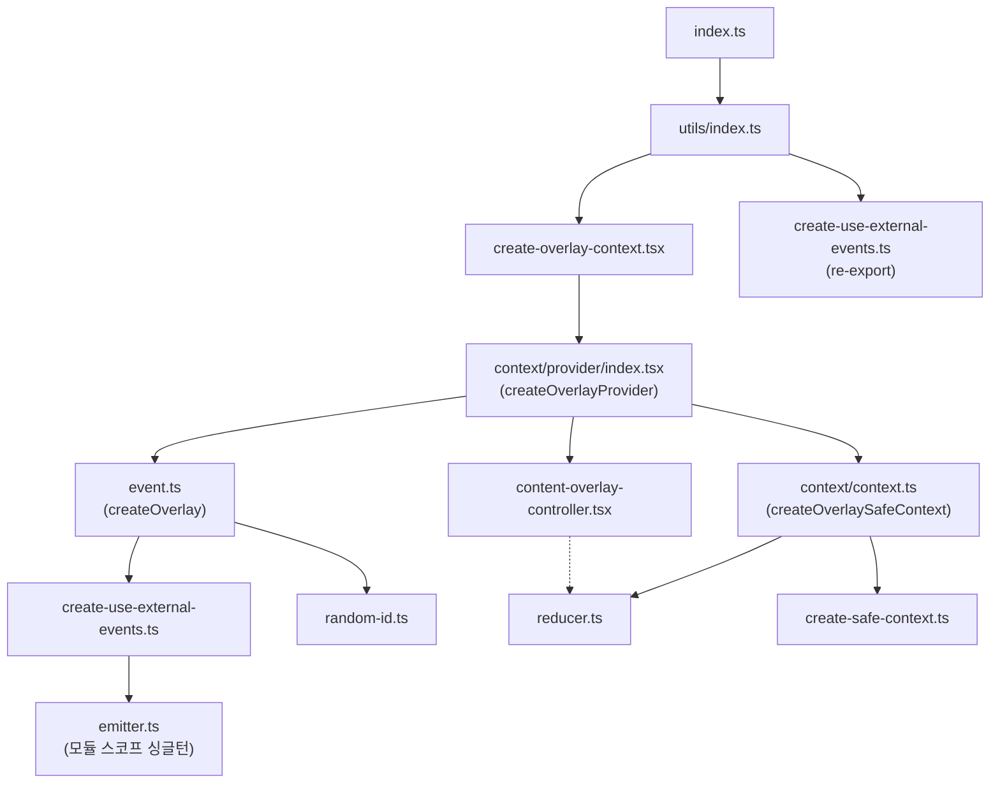

# 팩토리 패턴과 의존성 그래프

## 팩토리 패턴

모든 핵심 함수가 `create*` 팩토리 패턴입니다:

| 팩토리 | 생성하는 것 | 파일 |
|--------|------------|------|
| `createEmitter()` | 타입 안전한 이벤트 에미터 | `utils/emitter.ts` |
| `createUseExternalEvents(prefix)` | 이벤트 브릿지 (Hook + 디스패처 + 구독) | `utils/create-use-external-events.ts` |
| `createOverlay(overlayId)` | 명령형 API 객체 | `event.ts` |
| `createOverlaySafeContext()` | Context + Hook | `context/context.ts` |
| `createSafeContext(displayName)` | 안전한 React Context | `utils/create-safe-context.ts` |
| `createOverlayProvider()` | 위 모두를 조합한 완성품 | `context/provider/index.tsx` |

## 기본 인스턴스 생성

`create-overlay-context.tsx`가 기본 인스턴스를 하나 생성하여 내보냅니다:

```typescript
// utils/create-overlay-context.tsx
export const { overlay, OverlayProvider, useCurrentOverlay, useOverlayData } = createOverlayProvider();
```

이것이 사용자가 `import { overlay, OverlayProvider } from 'overlay-kit'`으로 사용하는 객체입니다.

## 다중 인스턴스

`experimental_createOverlayContext()`를 호출하면:

1. 새로운 `randomId()`로 고유 prefix 생성
2. 해당 prefix로 독립된 `createOverlay()` + `createOverlaySafeContext()` 생성
3. 독립된 `{ overlay, OverlayProvider }` 반환

```typescript
const { overlay: overlay2, OverlayProvider: OverlayProvider2 } = experimental_createOverlayContext();
```

각 인스턴스는:
- **같은 emitter 싱글턴**을 공유하지만
- **다른 prefix**를 사용하므로 이벤트가 격리됩니다

---

## 의존성 그래프



### 읽는 법

- **실선 화살표**: import 의존성
- **점선 화살표**: 타입만 import
- 진입점은 `index.ts` → `utils/index.ts` → `create-overlay-context.tsx`
- 핵심 조립은 `context/provider/index.tsx`에서 수행
- `event.ts`는 `create-use-external-events.ts`로부터 `[useExternalEvents, createEvent, subscribeEvent]` 3개를 destructuring

### export 경로

```
사용자 import
  → index.ts (re-export)
    → utils/index.ts (re-export)
      → create-overlay-context.tsx (인스턴스 생성)
        → context/provider/index.tsx (createOverlayProvider - 조립)
```

Public API에 새로운 export를 추가하려면 `utils/index.ts`와 `index.ts` 양쪽에서 re-export해야 합니다.
