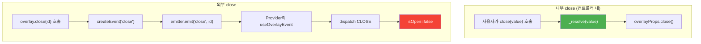

# openAsync 외부 close 버그 분석

## 문제 현상

`overlay.openAsync`로 열린 오버레이를 외부에서 닫으면 Promise가 영원히 resolve되지 않습니다.

```tsx
// 정상: 내부 close → Promise resolve ✅
const result = await overlay.openAsync<boolean>(({ isOpen, close }) => (
  <Dialog open={isOpen} onConfirm={() => close(true)} onClose={() => close(false)} />
));

// 비정상: 외부 close → Promise pending 영원히 ❌
overlay.close(overlayId);
overlay.closeAll();
overlay.unmount(overlayId);
overlay.unmountAll();
```

---

## 원인 분석

### 업스트림 `openAsync` 구조 (변경 전)

```typescript
function openAsync<T>(controller, options?) {
  return new Promise<T>((_resolve, _reject) => {
    open((overlayProps) => {
      // ⭐ close를 오버라이드하여 _resolve를 호출
      const close = (param: T) => {
        _resolve(param);          // Promise resolve
        overlayProps.close();     // 실제 오버레이 닫기
      };
      return controller({ ...overlayProps, close });
    }, options);
  });
}
```

`_resolve`는 **래핑된 `close()` 함수 안에서만** 호출됩니다. 이 `close()`는 컨트롤러 내부에서 사용자가 직접 호출하는 것입니다.

### 외부 close의 경로



**핵심 차이**: 외부 close는 emitter → Provider → reducer 경로를 타고, 컨트롤러의 래핑된 `close()` 함수를 **절대 거치지 않습니다**. 따라서 `_resolve`가 호출될 기회가 없습니다.

### 영향받는 외부 close 유형 4가지

| 외부 close 메서드 | emitter 이벤트 | 영향 |
|-------------------|---------------|------|
| `overlay.close(id)` | `close` | 해당 오버레이의 Promise pending |
| `overlay.closeAll()` | `closeAll` | **모든** openAsync Promise pending |
| `overlay.unmount(id)` | `unmount` | 해당 오버레이가 DOM에서 제거되나 Promise pending |
| `overlay.unmountAll()` | `unmountAll` | 모든 오버레이 제거 + 모든 Promise pending |

### `unmount`가 특히 위험한 이유

`close`는 `isOpen=false`로만 변경하므로 컨트롤러 컴포넌트가 DOM에 남아있습니다. 이론적으로 `isOpen` 변화를 감지할 수 있습니다.

하지만 `unmount`(`REMOVE` 액션)는 컨트롤러를 `overlayData`와 `overlayOrderList`에서 **완전히 삭제**합니다. React가 컴포넌트를 DOM에서 제거하므로 **re-render 자체가 일어나지 않습니다**. 따라서 `isOpen` 모니터링 방식으로는 `unmount`를 감지할 수 없습니다.

---

## 실제 프로덕션 영향

1. **메모리 누수**: 미resolve된 Promise와 관련 클로저가 GC되지 않음
2. **후속 로직 미실행**: `await overlay.openAsync(...)` 이후의 코드가 영원히 실행되지 않음
3. **사용자 경험 저하**: 페이지 전환, 전체 닫기 등의 시나리오에서 예기치 않은 동작

---

## 해결 방향: 왜 emitter 구독인가

| 접근 방식 | 평가 |
|-----------|------|
| `isOpen` prop 모니터링 | ❌ `unmount`/`unmountAll` 감지 불가 (컴포넌트가 DOM에서 제거됨) |
| `useEffect` cleanup | ❌ React 라이프사이클에 의존, openAsync의 Promise 스코프에서 접근 불가 |
| **emitter `subscribeEvent`** | ✅ 모든 외부 close 유형을 emitter 레벨에서 감지 가능 |

emitter는 React 렌더링 이전 단계에서 이벤트를 전파하므로, 컴포넌트가 DOM에서 제거되기 전에 이벤트를 받을 수 있습니다. 이것이 `subscribeEvent` 접근 방식을 채택한 핵심 이유입니다.

→ 다음: [01-subscribe-event.md](./01-subscribe-event.md) — `subscribeEvent` 구현 상세
