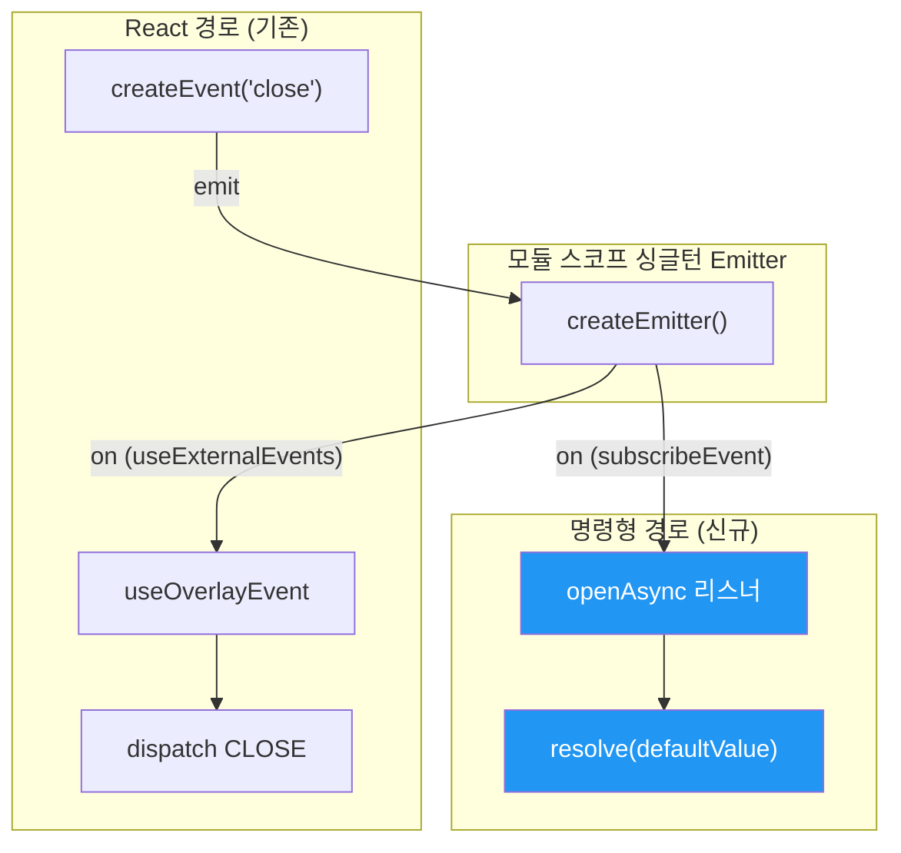

# subscribeEvent — 이벤트 브릿지 확장

## 변경 대상

`packages/src/utils/create-use-external-events.ts`

## 업스트림과의 차이

### 반환값 변경

```typescript
// 업스트림 (toss/overlay-kit)
export function createUseExternalEvents<EventHandlers>(prefix: string) {
  // ...
  return [useExternalEvents, createEvent] as const;
}

// 포크 (overlay-kit-async)
export function createUseExternalEvents<EventHandlers>(prefix: string) {
  // ...
  return [useExternalEvents, createEvent, subscribeEvent] as const;
}
```

| 인덱스 | 반환값 | 업스트림 | 내부 포크 | 역할 |
|--------|--------|----------|-----------|------|
| `[0]` | `useExternalEvents` | ✅ | ✅ | React Hook — Provider 내부에서 이벤트 핸들러 등록 |
| `[1]` | `createEvent` | ✅ | ✅ | 이벤트 디스패처 팩토리 — `overlay.close()` 등 |
| `[2]` | `subscribeEvent` | ❌ | ✅ | 명령형 이벤트 구독 — `openAsync` 내부에서 사용 |

---

## `subscribeEvent` 구현

```typescript
function subscribeEvent<EventKey extends keyof EventHandlers>(
  event: EventKey,
  handler: EventHandlers[EventKey]
): () => void {
  const eventKey = `${prefix}:${String(event)}`;
  const wrappedHandler = (payload: Parameters<EventHandlers[EventKey]>[0]) => {
    handler(payload);
  };
  emitter.on(eventKey, wrappedHandler);
  return () => {
    emitter.off(eventKey, wrappedHandler);
  };
}
```

### 설계 포인트

#### 1. prefix 네임스페이싱 준수

기존 `useExternalEvents`, `createEvent`와 동일하게 `${prefix}:${event}` 형태의 이벤트 키를 사용합니다. 다중 overlay 인스턴스 환경에서도 이벤트가 격리됩니다.

```
overlay-kit-abc123/overlay-kit:close   ← 인스턴스 A의 close
overlay-kit-def456/overlay-kit:close   ← 인스턴스 B의 close (충돌 없음)
```

#### 2. wrappedHandler 패턴

`emitter.off`는 핸들러 참조로 제거하므로, `wrappedHandler`를 클로저에 캡처하여 정확한 해제를 보장합니다.

```typescript
// ✅ 올바른 해제: 같은 참조
emitter.on(eventKey, wrappedHandler);
return () => emitter.off(eventKey, wrappedHandler);

// ❌ 잘못된 해제: 새로운 함수 참조 → off 실패
emitter.on(eventKey, (payload) => handler(payload));
return () => emitter.off(eventKey, (payload) => handler(payload));  // 다른 참조!
```

#### 3. unsubscribe 함수 반환

React Hook과 달리 자동 cleanup이 없으므로, 호출자가 명시적으로 unsubscribe를 관리해야 합니다. `openAsync`에서는 `cleanup()` 함수가 이 역할을 합니다.

---

## 기존 구조와의 관계



**핵심**: 같은 emitter 인스턴스, 같은 이벤트를 두 경로가 동시에 수신합니다.

- **React 경로** (`useExternalEvents`): 이벤트 → dispatch → 상태 변경 → UI 업데이트
- **명령형 경로** (`subscribeEvent`): 이벤트 → Promise resolve → cleanup

두 경로는 독립적으로 동작하며, emitter의 `emit`이 등록된 모든 핸들러를 순회하므로 둘 다 실행됩니다.

---

## 영향 범위

### 하위 호환성

- `useExternalEvents`, `createEvent`의 동작은 변경 없음
- 반환 배열에 3번째 요소가 추가되었으나, 기존 destructuring `[useExternalEvents, createEvent]`은 정상 동작 (나머지 무시)
- 신규 코드만 `subscribeEvent`를 사용

### 사용처

현재 `subscribeEvent`를 사용하는 곳은 `event.ts`의 `openAsync` **한 곳**뿐입니다.

→ 다음: [02-open-async-overloads.md](./02-open-async-overloads.md) — openAsync에서의 사용
