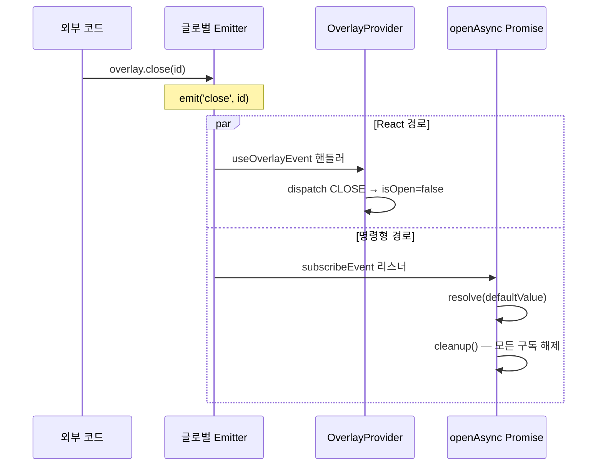

# openAsync Function Overloads + defaultValue

## 변경 대상

`packages/src/event.ts`

## 업스트림과의 차이

### 타입 정의 추가

```typescript
// 기존 (업스트림과 동일)
type OpenOverlayOptions = {
  overlayId?: string;
};

// 신규 (내부 포크)
type OpenAsyncOverlayOptions<T> = OpenOverlayOptions & {
  defaultValue: T;     // 외부 close 시 resolve될 기본값 (required)
};
```

### Function Overload 시그니처

```typescript
// 시그니처 1: defaultValue 전달 → Promise<T> (외부 close 시 defaultValue로 resolve)
function openAsync<T>(
  controller: OverlayAsyncControllerComponent<T>,
  options: OpenAsyncOverlayOptions<T>
): Promise<T>;

// 시그니처 2: defaultValue 미전달 → Promise<T | undefined> (외부 close 시 undefined로 resolve)
function openAsync<T>(
  controller: OverlayAsyncControllerComponent<T>,
  options?: OpenOverlayOptions
): Promise<T | undefined>;

// 구현 시그니처 (외부에 노출되지 않음)
function openAsync<T>(
  controller: OverlayAsyncControllerComponent<T>,
  options?: OpenOverlayOptions | OpenAsyncOverlayOptions<T>
): Promise<T | undefined> {
  // ...
}
```

**핵심**: `defaultValue`를 넘기면 `Promise<T>`, 안 넘기면 `Promise<T | undefined>`를 반환합니다. 이는 **Breaking Change**이며, semver major bump이 필요합니다.

---

## 타입 분기 상세

### `defaultValue` 전달 시 (객체 타입 + null 권장)

```tsx
type UserSelection = { id: number; name: string };

const result = await overlay.openAsync<UserSelection | null>(
  ({ isOpen, close }) => (
    <UserPicker open={isOpen} onSelect={(user) => close(user)} />
  ),
  { defaultValue: null }
);
// result의 타입: UserSelection | null

// 사용자가 선택 → UserSelection 객체
// 외부에서 close → null
overlay.close(overlayId);  // → result === null
overlay.closeAll();         // → result === null
```

TypeScript가 `OpenAsyncOverlayOptions<T>`의 `defaultValue: T`가 required임을 보고, 첫 번째 overload 시그니처를 선택합니다. `T`가 `UserSelection | null`이므로 반환 타입은 `Promise<UserSelection | null>`입니다.

### `defaultValue` 미전달 시

```tsx
const result = await overlay.openAsync<boolean>(
  ({ isOpen, close }) => <Dialog open={isOpen} onConfirm={() => close(true)} onClose={() => close(false)} />
);
// result의 타입: boolean | undefined

// 내부 close(true) → true
// 외부에서 close → undefined로 resolve (더 이상 pending 안 됨)

if (result === undefined) {
  // 외부에서 닫힌 경우
  return;
}
// 여기부턴 result: boolean으로 안전하게 사용 가능
```

두 번째 overload 시그니처가 선택되어 반환 타입이 `Promise<T | undefined>`입니다. TypeScript가 `undefined` 가능성을 알려주므로, 개발자가 자연스럽게 분기 처리하게 됩니다.

---

## 구현 내부 동작

### `hasDefaultValue` 분기

```typescript
const hasDefaultValue = options != null && 'defaultValue' in options;
```

런타임에서 `defaultValue` 존재 여부를 판별합니다. `in` 연산자를 사용하여 값이 `undefined`인 경우와 키 자체가 없는 경우를 구분합니다. 이 분기는 **resolve할 값을 결정**하는 데 사용됩니다 (`defaultValue` vs `undefined`).

### subscribeEvent 구독 (무조건)

```typescript
const resolveValue = hasDefaultValue ? (options as OpenAsyncOverlayOptions<T>).defaultValue : undefined;

const unsubscribeClose = subscribeEvent('close', (closedOverlayId: string) => {
  if (closedOverlayId === currentOverlayId) {
    resolve(resolveValue);
  }
});

const unsubscribeCloseAll = subscribeEvent('closeAll', () => {
  resolve(resolveValue);
});

const unsubscribeUnmount = subscribeEvent('unmount', (unmountedOverlayId: string) => {
  if (unmountedOverlayId === currentOverlayId) {
    resolve(resolveValue);
  }
});

const unsubscribeUnmountAll = subscribeEvent('unmountAll', () => {
  resolve(resolveValue);
});
```

#### 왜 항상 구독하는가

Breaking Change (B안) 채택으로, `defaultValue` 유무와 관계없이 **모든 `openAsync` 호출이 항상 resolve**됩니다. 조건부 구독(`noop` 패턴)이 제거되어 코드가 단순해졌습니다.

- `defaultValue` 전달 시 → 외부 close에서 `defaultValue`로 resolve
- `defaultValue` 미전달 시 → 외부 close에서 `undefined`로 resolve

#### `close` vs `closeAll` 차이

- **`close`/`unmount`**: `overlayId`를 인자로 받으므로, `currentOverlayId`와 일치하는 경우에만 resolve
- **`closeAll`/`unmountAll`**: 인자 없이 모든 오버레이에 적용되므로, 무조건 resolve

### 내부 close 래퍼

```typescript
open(
  (overlayProps, ...deprecatedLegacyContext) => {
    const close = (param: T) => {
      resolve(param);              // ← 사용자가 전달한 값으로 resolve
      overlayProps.close();
    };
    const props: OverlayAsyncControllerProps<T> = {
      ...overlayProps,
      close,
      reject: (reason?: unknown) => {
        reject(reason);
        overlayProps.close();
      },
    };
    return controller(props, ...deprecatedLegacyContext);
  },
  { overlayId: currentOverlayId }
);
```

내부 close는 기존과 동일하게 `param` 값으로 resolve합니다. `resolve()` 내부의 `resolved` 플래그가 이중 호출을 방지하므로, 내부 close와 외부 close가 경합해도 안전합니다.

#### `resolveValue`의 타입

```typescript
const resolveValue = hasDefaultValue ? (options as OpenAsyncOverlayOptions<T>).defaultValue : undefined;
// resolveValue: T | undefined
```

`resolveValue`는 `T | undefined` 타입입니다. `hasDefaultValue`가 `true`이면 `T`, `false`이면 `undefined`입니다. 구현 시그니처의 반환 타입이 `Promise<T | undefined>`이므로 캐스팅 없이 안전하게 사용됩니다.

---

## 데이터 흐름 (외부 close 시)



두 경로가 **동시에** 실행됩니다. React 경로는 UI를 업데이트하고, 명령형 경로는 Promise를 settle합니다.

---

## 업스트림 대비 호환성

| 시나리오 | 업스트림 동작 | 내부 포크 동작 | 호환 여부 |
|----------|-------------|---------------|-----------|
| `openAsync(ctrl)` (옵션 없음) | `Promise<T>`, 외부 close 시 pending | `Promise<T \| undefined>`, 외부 close 시 `undefined`로 resolve | ⚠️ **Breaking** — 타입 + 런타임 변경 |
| `openAsync(ctrl, { overlayId })` | `Promise<T>`, 외부 close 시 pending | `Promise<T \| undefined>`, 외부 close 시 `undefined`로 resolve | ⚠️ **Breaking** — 타입 + 런타임 변경 |
| `openAsync(ctrl, { defaultValue })` | N/A (옵션 없음) | `Promise<T>`, 외부 close 시 defaultValue로 resolve | ✅ 신규 기능 |
| 내부 `close(value)` 호출 | resolve(value) | resolve(value) | ✅ 동일 |
| 내부 `reject(reason)` 호출 | reject(reason) | reject(reason) | ✅ 동일 |

**Breaking Change (B안)**: `defaultValue` 없이 호출 시 반환 타입이 `Promise<T>` → `Promise<T | undefined>`로 변경됩니다. 런타임에서도 외부 close 시 `undefined`로 resolve됩니다 (기존: pending). Changeset에 major bump으로 등록되어 있습니다.

자세한 결정 배경은 [06-breaking-change-decision.md](../06-breaking-change-decision.md)를 참조하세요.

→ 다음: [03-safety-mechanisms.md](./03-safety-mechanisms.md) — 안전장치 상세
