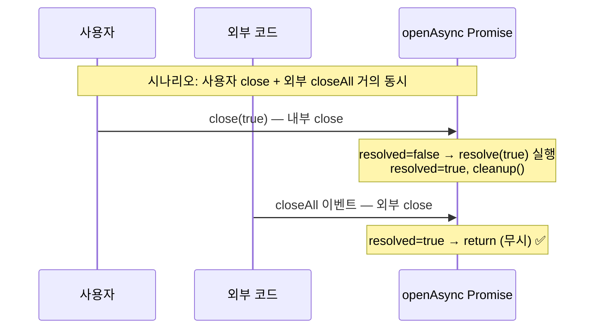
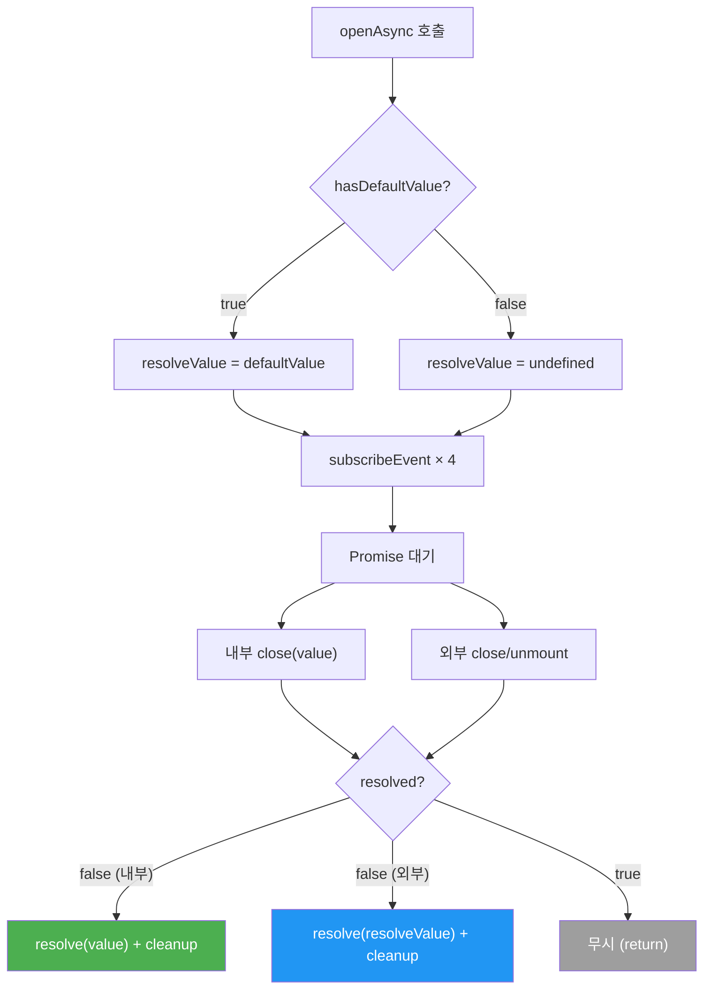

# 안전장치 — 이중 resolve 방지, cleanup, 무조건 구독

## 변경 대상

`packages/src/event.ts` — `openAsync` 내부

---

## 1. 이중 resolve 방지 (`resolved` 플래그)

### 문제

내부 `close(value)`와 외부 `overlay.close(id)`가 거의 동시에 호출될 수 있습니다. Promise는 한 번만 settle 가능하므로 두 번째 호출은 무시되어야 합니다.

### 구현

```typescript
let resolved = false;

const resolve = (value: T | undefined) => {
  if (resolved) {
    return;          // ← 이미 settle된 경우 무시
  }
  resolved = true;
  cleanup();
  _resolve(value);
};

const reject = (reason?: unknown) => {
  if (resolved) {
    return;          // ← 이미 settle된 경우 무시
  }
  resolved = true;
  cleanup();
  _reject(reason);
};
```

### resolve/reject가 경합하는 시나리오



### 왜 단순한 Promise 동작에 기대하지 않는가

JavaScript의 Promise는 한 번 settle되면 이후 `resolve`/`reject` 호출을 조용히 무시합니다. 그러나:

1. **cleanup 보장**: `resolved` 플래그 없이는 두 번째 호출 시에도 `cleanup()`이 실행되지 않아 리스너가 남을 수 있음
2. **의도 명시**: 코드를 읽는 사람이 이중 호출 가능성을 인지하고, 의도적으로 처리하고 있음을 표현
3. **reject → resolve 순서 방지**: `_reject` 후 외부 close의 `_resolve`가 호출되는 것을 차단

---

## 2. 리스너 정리 (`cleanup`)

### 문제

`subscribeEvent`로 등록한 4개의 emitter 리스너(`close`, `closeAll`, `unmount`, `unmountAll`)가 Promise settle 후에도 남아있으면:

- emitter의 핸들러 배열이 계속 커짐 → 메모리 누수
- 이미 resolve된 Promise의 클로저가 GC되지 않음
- 다른 오버레이의 `closeAll` 이벤트를 불필요하게 수신

### 구현

```typescript
const cleanup = () => {
  unsubscribeClose();
  unsubscribeCloseAll();
  unsubscribeUnmount();
  unsubscribeUnmountAll();
};
```

`cleanup()`은 `resolve()`와 `reject()` 내부에서 호출됩니다. Promise가 settle되는 순간 즉시 모든 구독이 해제됩니다.

### 호출 시점

| 트리거 | cleanup 호출 | 설명 |
|--------|-------------|------|
| 내부 `close(value)` | ✅ | `resolve(value)` → `cleanup()` |
| 내부 `reject(reason)` | ✅ | `reject(reason)` → `cleanup()` |
| 외부 `overlay.close(id)` | ✅ | subscribeEvent 리스너 → `resolve(defaultValue)` → `cleanup()` |
| 외부 `overlay.closeAll()` | ✅ | subscribeEvent 리스너 → `resolve(defaultValue)` → `cleanup()` |
| 외부 `overlay.unmount(id)` | ✅ | subscribeEvent 리스너 → `resolve(defaultValue)` → `cleanup()` |
| 외부 `overlay.unmountAll()` | ✅ | subscribeEvent 리스너 → `resolve(defaultValue)` → `cleanup()` |

**모든 경로에서 cleanup이 보장됩니다.**

---

## 3. 무조건 구독 (B안 — 조건부 구독 제거)

### 이전 동작 (A안)

`defaultValue`가 전달되지 않으면 emitter 구독을 하지 않고 `noop`을 할당하여 불필요한 리스너를 방지했습니다.

### 현재 동작 (B안)

**모든 `openAsync` 호출이 항상 4개 이벤트를 구독합니다.** 조건부 구독(`noop` 패턴)이 제거되었습니다.

```typescript
const hasDefaultValue = options != null && 'defaultValue' in options;
const resolveValue = hasDefaultValue ? (options as OpenAsyncOverlayOptions<T>).defaultValue : undefined;

const unsubscribeClose = subscribeEvent('close', (closedOverlayId: string) => {
  if (closedOverlayId === currentOverlayId) {
    resolve(resolveValue);
  }
});

const unsubscribeCloseAll = subscribeEvent('closeAll', () => {
  resolve(resolveValue);
});

// ... unmount, unmountAll도 동일
```

### 왜 항상 구독하는가

B안 채택으로 **Pending Promise가 원천 차단**됩니다. `defaultValue` 유무와 관계없이 모든 외부 close/unmount 이벤트에서 Promise가 resolve됩니다.

| `hasDefaultValue` | subscribeEvent 호출 | resolve 값 | cleanup 동작 |
|-------------------|--------------------|-----------:|--------------|
| `true` | 4개 리스너 등록 | `defaultValue` (T) | 4개 unsubscribe 호출 |
| `false` | 4개 리스너 등록 | `undefined` | 4개 unsubscribe 호출 |

### 단순화 효과

조건부 구독 제거로 코드가 단순해졌습니다:

```typescript
// ✅ 현재 (B안): 항상 구독, 항상 cleanup
const cleanup = () => {
  unsubscribeClose();
  unsubscribeCloseAll();
  unsubscribeUnmount();
  unsubscribeUnmountAll();
};

// 이전 (A안): noop 분기 필요
// const unsubscribeClose = hasDefaultValue ? subscribeEvent(...) : noop;
```

---

## 안전장치 종합 요약


