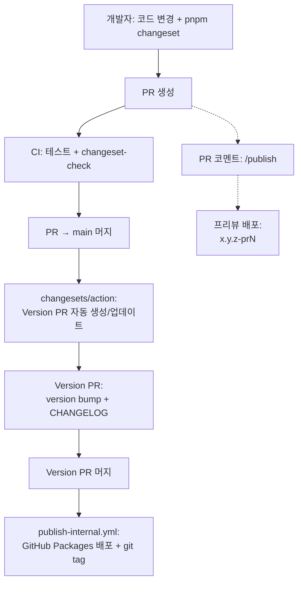

# 릴리스 플로우

> Changeset 기반 버전 관리와 GitHub Packages 배포 플로우를 설명합니다.

## 한 줄 요약

`pnpm changeset` → PR 머지 → **봇이 Version PR 자동 생성** → 머지하면 자동 배포

## 전체 플로우

## 역할 분담

| 역할 | 하는 일 | 안 하는 일 |
|------|---------|-----------|
| **개발자** | `pnpm changeset` + PR | version bump, publish |
| **changesets/action** | Version PR 생성/업데이트 | 배포 |
| **publish-internal.yml** | GitHub Packages 배포 + git tag | version bump |
| **메인테이너** | Version PR 머지 (릴리스 결정) | 수동 version bump |

## 관련 워크플로우

| 워크플로우 | 트리거 | 역할 |
|-----------|--------|------|
| `ci.yml` | PR, main push | 테스트, 린트, 빌드 |
| `changeset-check.yml` | PR | `packages/src/` 변경 시 changeset 필수 체크 |
| `release.yml` | main push | changesets/action — Version PR 자동 생성 |
| `publish-internal.yml` | main push | GitHub Packages 배포 (버전 변경 시) |
| `publish-comment.yml` | PR 코멘트 `/publish` | 프리뷰 버전 배포 (`x.y.z-prN`) |

## 상세 문서

| 문서 | 내용 |
|------|------|
| [00-changeset-workflow.md](./00-changeset-workflow.md) | Changeset 기본 워크플로우 — 파일 구조, bump 타입, 설정 |
| [01-scenarios.md](./01-scenarios.md) | 시나리오별 상세 — 일반 개발, 다중 PR, 프리뷰 배포, 실수 대응 |
| [02-pitfalls.md](./02-pitfalls.md) | 주의사항 — GITHUB_TOKEN 함정, 이중 배포, 수동 bump 충돌 |

## 핵심 설정

| 설정 | 값 | 의미 |
|------|-----|------|
| `.changeset/config.json → baseBranch` | `main` | 릴리스 대상 브랜치 |
| `.changeset/config.json → commit` | `false` | changeset version 후 자동 커밋 안 함 |
| `.changeset/config.json → access` | `restricted` | GitHub Packages 비공개 배포 |
| `.changeset/config.json → changelog` | `@changesets/changelog-github` | PR 링크, 커밋 해시 포함 CHANGELOG 생성 |
| `packages/package.json → publishConfig.registry` | `npm.pkg.github.com` | GitHub Packages 레지스트리 |
