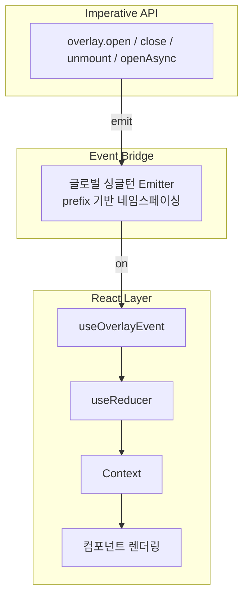

# overlay-kit 내부 아키텍처

> 코드를 처음 보는 사람이 전체 동작 방식을 이해할 수 있도록 작성된 내부 문서입니다.

## 한 줄 요약

`overlay.open()` → **글로벌 Event Emitter** → `OverlayProvider`의 `useReducer` → React 렌더링

React 바깥의 명령형 호출을, Event Emitter를 브릿지 삼아 React 상태로 변환합니다.

## 아키텍처 오버뷰



## 소스 파일 구조

```
packages/src/
├── index.ts                                  # Public API 배럴
├── event.ts                                  # createOverlay() — 명령형 API 팩토리
├── context/
│   ├── context.ts                            # createOverlaySafeContext()
│   ├── reducer.ts                            # overlayReducer — 상태 전이
│   └── provider/
│       ├── index.tsx                          # createOverlayProvider() — 전체 조립
│       └── content-overlay-controller.tsx     # 개별 오버레이 렌더링
└── utils/
    ├── index.ts                              # 배럴
    ├── create-overlay-context.tsx             # 기본 인스턴스 생성
    ├── create-use-external-events.ts          # 이벤트 브릿지
    ├── create-safe-context.ts                 # 안전한 Context 래퍼
    ├── emitter.ts                             # 경량 pub/sub
    └── random-id.ts                           # ID 생성
```

## Public API

```typescript
import { overlay, OverlayProvider } from 'overlay-kit';
```

| Export | 설명 |
|--------|------|
| `overlay` | 명령형 API 객체 — `open`, `openAsync`, `close`, `unmount`, `closeAll`, `unmountAll` |
| `OverlayProvider` | React Provider 컴포넌트 — 앱 루트에 배치 |
| `useCurrentOverlay` | 현재 최상위 오버레이 ID를 반환하는 Hook |
| `useOverlayData` | 전체 오버레이 상태를 반환하는 Hook |
| `experimental_createOverlayContext` | 독립된 overlay 인스턴스 생성 팩토리 |

## 상세 문서

| 문서 | 내용 |
|------|------|
| [00-layer-architecture.md](./00-layer-architecture.md) | 3-레이어 구조와 설계 의도 |
| [01-core-modules.md](./01-core-modules.md) | 각 소스 파일의 역할과 구현 상세 |
| [02-lifecycle.md](./02-lifecycle.md) | open → close → unmount 라이프사이클 흐름 |
| [03-factory-and-dependencies.md](./03-factory-and-dependencies.md) | 팩토리 패턴, 다중 인스턴스, 의존성 그래프 |
| [04-fork-rationale/](./04-fork-rationale/) | 업스트림(toss/overlay-kit) 대비 포크 차이점과 배경 |
| [05-release-flow/](./05-release-flow/) | Changeset 기반 릴리스 플로우, 시나리오별 가이드, 주의사항 |

## 핵심 설계 포인트

- **Event Emitter 브릿지**: React 바깥 명령형 코드 ↔ React 상태를 이벤트로 연결
- **2-phase open**: `isOpen: false`로 마운트 → `rAF` → `isOpen: true`로 CSS transition 보장
- **팩토리 패턴**: 모든 핵심 함수가 `create*` 형태 — 다중 독립 인스턴스 지원
- **모듈 싱글턴 Emitter**: 하나의 emitter를 공유하되 prefix로 인스턴스 간 격리
- **close ≠ unmount**: close는 `isOpen: false` (DOM 유지, 애니메이션 가능), unmount는 DOM에서 완전 제거
